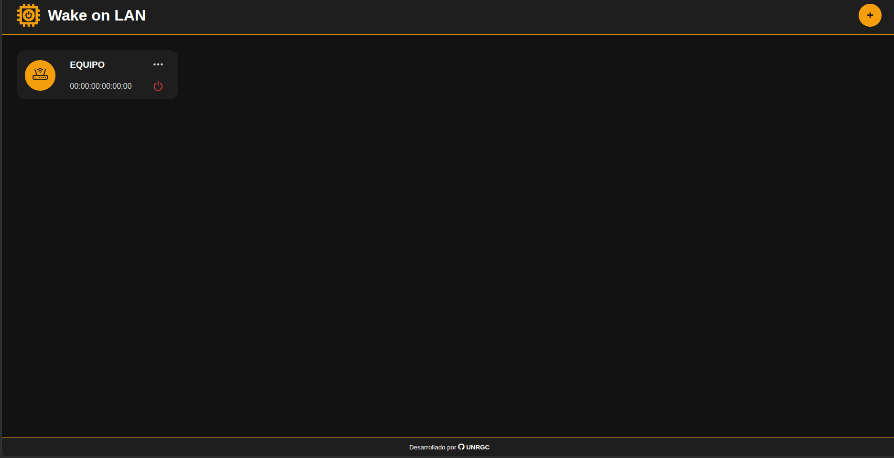
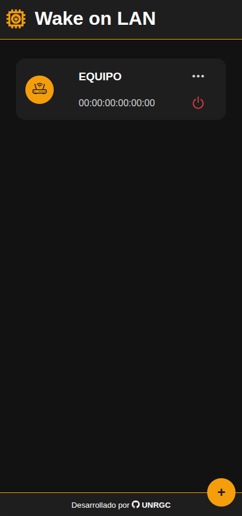
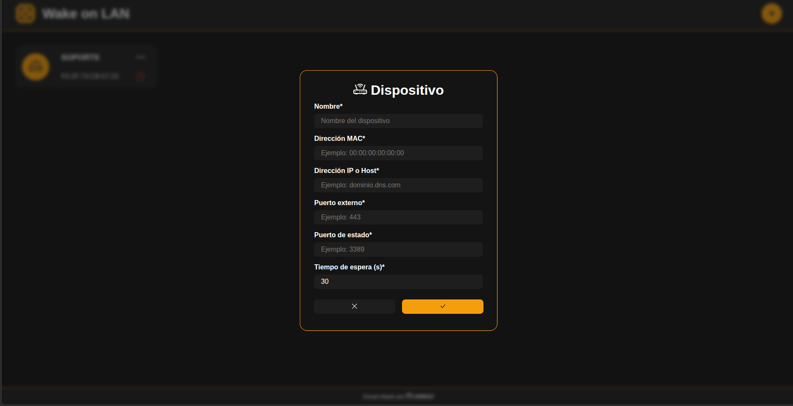
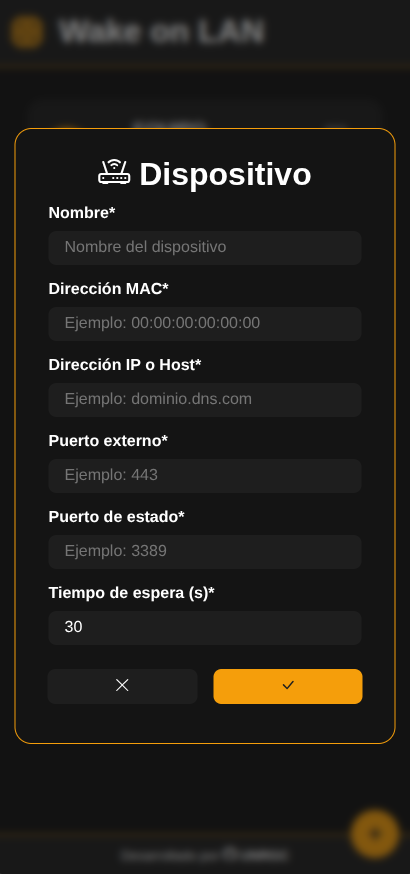
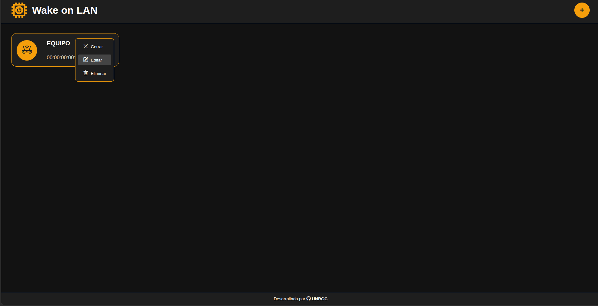
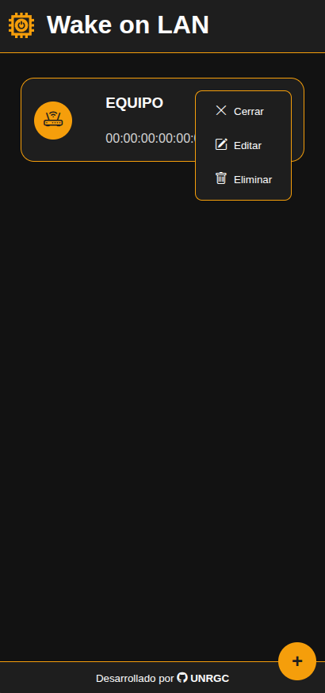

# Wake on LAN

Aplicación web para gestionar dispositivos y enviar señales **Wake on LAN (WOL)** desde una interfaz sencilla.

## Características

- Alta, edición y eliminación de dispositivos.
- Consulta del estado del equipo por puerto de estado.
- Envío de señal Wake on LAN desde el navegador.
- Persistencia local de dispositivos en `localStorage`.
- Servicio abierto: no requiere registro ni inicio de sesión.

## Requisitos

- [Node.js](https://nodejs.org/) 18 o superior.
- `npm`.

## Instalación

```bash
npm install
```

## Configuración

1. Copia el archivo de ejemplo:

```bash
cp .env-example .env
```

2. Ajusta las variables de entorno según tu entorno local.

### Variables de entorno

- `PORT`: puerto donde se ejecuta el servidor. Por defecto: `3000`.
- `TRUST_PROXY`: usar IP real detrás de proxy inverso. Por defecto: `true`.
- `RATE_LIMIT_WINDOW_MS`: ventana de rate limit para `/wol` en ms. Por defecto: `60000`.
- `RATE_LIMIT_MAX_REQUESTS`: máximo de solicitudes por IP en esa ventana. Por defecto: `60`.
- `REQUEST_TIMEOUT_MS`: timeout de cada solicitud HTTP en ms. Por defecto: `12000`.
- `STATUS_SOCKET_TIMEOUT_MS`: timeout del chequeo TCP de estado en ms. Por defecto: `5000`.
- `HOST_ALLOWLIST` (opcional): hosts/IP permitidos, separados por coma.

### Perfiles recomendados (.env)

Servicio publico sin registro, con mitigaciones anti abuso.

`Render (publico, mas estricto)`

```env
PORT=3000
TRUST_PROXY=true
RATE_LIMIT_WINDOW_MS=60000
RATE_LIMIT_MAX_REQUESTS=30
REQUEST_TIMEOUT_MS=10000
STATUS_SOCKET_TIMEOUT_MS=4000
# HOST_ALLOWLIST=pc-casa.ejemplo.com,203.0.113.10
```

`Self-hosting (permisivo)`

```env
PORT=3000
TRUST_PROXY=false
RATE_LIMIT_WINDOW_MS=60000
RATE_LIMIT_MAX_REQUESTS=180
REQUEST_TIMEOUT_MS=15000
STATUS_SOCKET_TIMEOUT_MS=7000
# HOST_ALLOWLIST=
```

## Ejecución

```bash
node main.js
```

Después abre la aplicación en el navegador usando la URL que aparezca en la consola.

## Demo pública

Puedes probar la versión funcional desplegada en Render aquí:

- https://wol-qzr2.onrender.com/

## Capturas de pantalla

### Vista principal

<table align="center">
  <tr>
	<th>Vista PC</th>
	<th>Vista móvil</th>
  </tr>
  <tr>
	<td align="center"></td>
	<td align="center"></td>
  </tr>
</table>

### Dispositivo

<table align="center">
  <tr>
	<th>Vista PC</th>
	<th>Vista móvil</th>
  </tr>
  <tr>
	<td align="center"></td>
	<td align="center"></td>
  </tr>
</table>

### Opciones

<table align="center">
  <tr>
	<th>Vista PC</th>
	<th>Vista móvil</th>
  </tr>
  <tr>
	<td align="center"></td>
	<td align="center"></td>
  </tr>
</table>

## Estructura general

- `main.js`: servidor principal.
- `src/`: lógica del backend.
- `public/`: frontend estático.
- `.env-example`: ejemplo de variables de entorno.

## Notas

- Los dispositivos se guardan en el navegador usando `localStorage`.
- Si agregas más variables de entorno, actualiza también `.env-example` y esta documentación.


